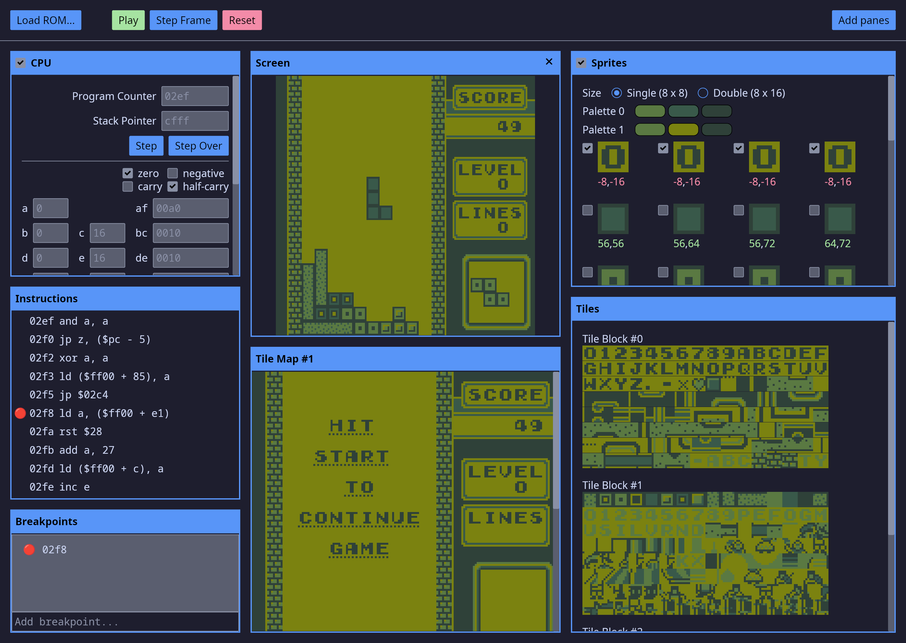

# MissingNo.
MissingNo. is a Game Boy emulator and debugger written in Rust.



## Features
  - Keyboard and controller support
  - Save RAM support for battery-backed cartridges
  - Fullscreen mode (F11)

## Debugger
  - Code disassembly and breakpoints
  - View emulated hardware state
  - View video memory - tiles, tilemaps, and sprites

## Building
MissingNo. is pre-release software - [source is available on GitHub](https://github.com/ajoneil/missingno).

To build from source, first [install rust](https://www.rust-lang.org/tools/install) and then run the following command:
```
cargo run --release
```
