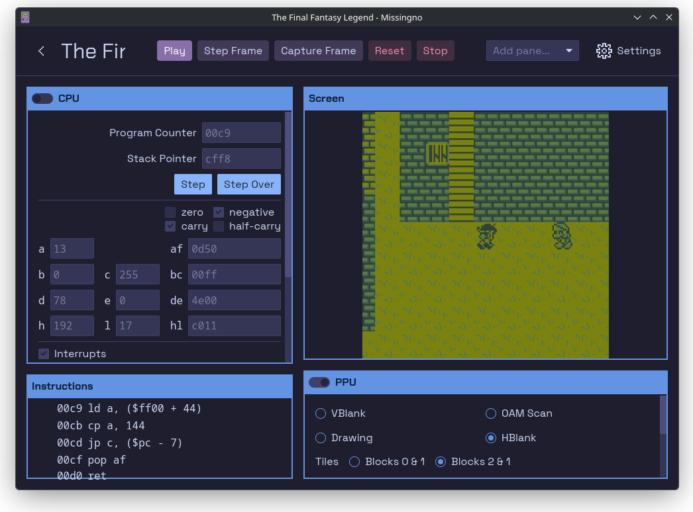

# MissingNo.
MissingNo. is a Game Boy emulator and debugger written in Rust.



## Install

<a href="https://flathub.org/apps/net.andyofniall.missingno">
  
</a>

Linux builds are available on [Flathub](https://flathub.org/apps/net.andyofniall.missingno). Official builds for other platforms are not currently available.

## Features
  - Keyboard and controller support
  - Save RAM support for battery-backed cartridges
  - Fullscreen mode (F11)

## Debugger
  - Code disassembly and breakpoints
  - View emulated hardware state
  - View video memory - tiles, tilemaps, and sprites

## Building from Source

To build from source, first [install Rust](https://www.rust-lang.org/tools/install) and then run:
```
cargo run --release
```
