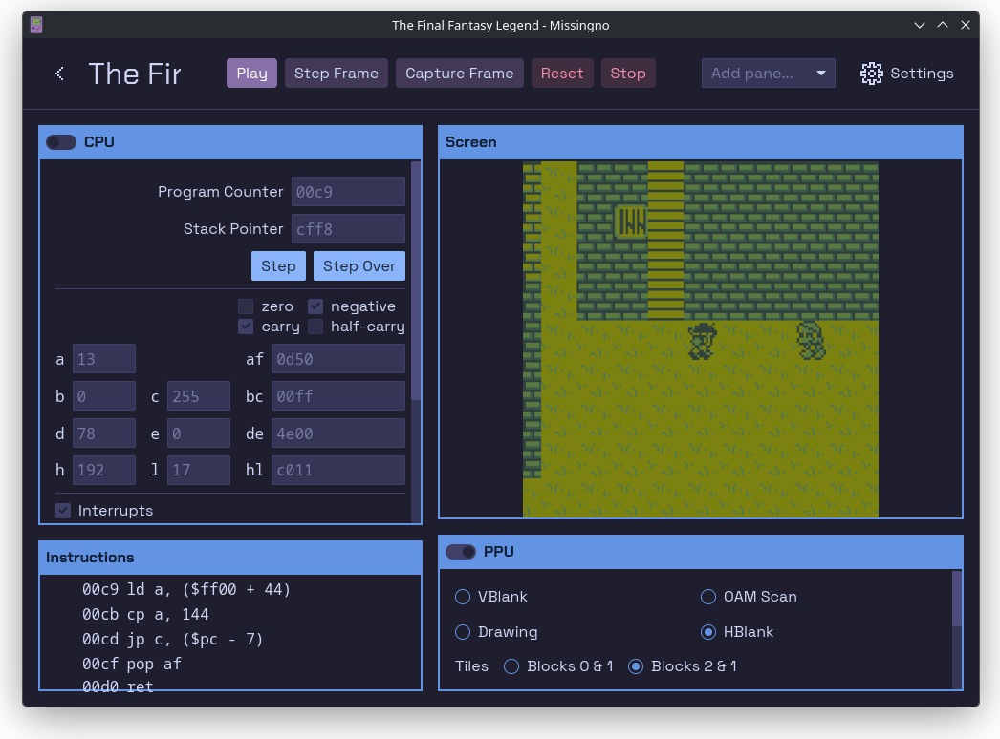

# Missingno

A Game Boy emulator and debugger written in Rust, focused on hardware accuracy and helping you manage, preserve, and discover games.



## Install

<a href="https://flathub.org/apps/net.andyofniall.missingno">
  
</a>

Linux builds are available on [Flathub](https://flathub.org/apps/net.andyofniall.missingno). Official builds for other platforms are not currently available.

## Building from Source

[Install Rust](https://www.rust-lang.org/tools/install), then:

```
cargo run --release
```

## Cartridge Reader/Writer

Missingno can read ROMs and save data from physical cartridges using a [GBxCart RW](https://www.gbxcart.com/) device. On Linux, you may need to install a [udev rule](71-gbxcart.rules) for the device to be accessible:

```
sudo cp 71-gbxcart.rules /etc/udev/rules.d/
sudo udevadm control --reload-rules
sudo udevadm trigger
```
